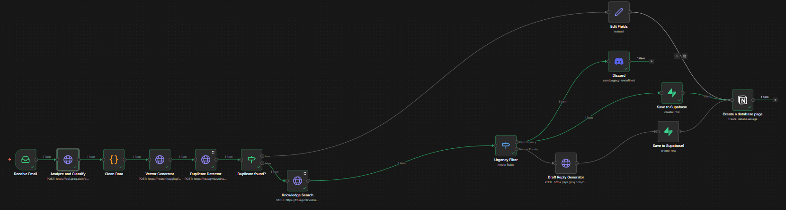
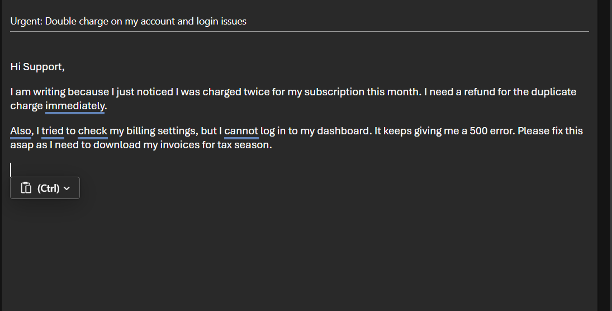
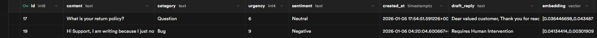
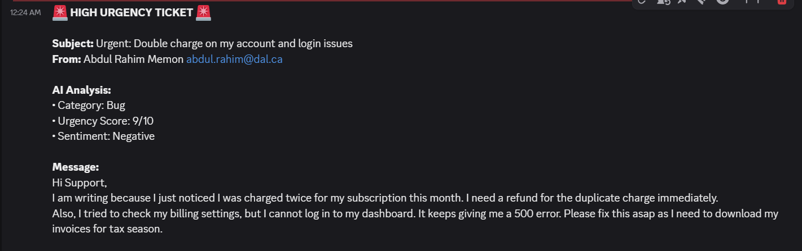
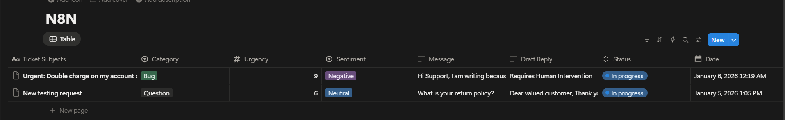

# 🤖 Sentient AI Support Agent  
**n8n + Llama 3 + Supabase**

An autonomous customer support workflow that *remembers past tickets*, *reads company policies using RAG*, and *intelligently drafts responses*.

---

## 📖 Project Overview

This project is an **AI-powered customer support agent** designed to automate customer support emails.  
Unlike basic chatbots, this agent has **memory**, **context awareness**, and **decision-making logic**.

It follows a **Split-Brain Architecture**:

### 🧠 Memory Layer
- Checks whether a similar issue has already been solved
- Uses **vector embeddings** for similarity search
- Instantly reuses proven responses to reduce cost and latency

### 🤔 Reasoning Layer
- Triggered when no similar ticket is found
- Searches company policies using **Retrieval-Augmented Generation (RAG)**
- Uses **Llama 3 (70B)** to generate accurate, policy-aligned responses

---

## ✨ Key Features

- **Duplicate Detection**  
  Prevents repeated LLM calls for already-solved issues.

- **RAG (Retrieval-Augmented Generation)**  
  Reads internal PDFs and text policies to avoid hallucinations.

- **Urgency & Sentiment Triage**  
  Detects angry customers or critical bugs and sends alerts to Discord.

- **Live Dashboard**  
  Syncs tickets and AI-generated drafts to Notion in real time.

---

## 🛠️ Tech Stack

| Component | Technology |
|---------|------------|
| Workflow Engine | n8n (Self-Hosted or Cloud) |
| LLM Provider | Groq (Llama 3–70B) |
| Vector Database | Supabase (PostgreSQL + pgvector) |
| Embeddings | Hugging Face (`all-mpnet-base-v2`) |
| Dashboard | Notion |

---

## 🚀 Getting Started

### Prerequisites

Ensure you have accounts and API keys for:

- n8n (Local or Cloud)
- Supabase
- Groq
- Hugging Face
- Notion
- Email account with IMAP access

---

## 🗄️ Step 1: Setup the Database (Supabase)

This agent requires storage for **ticket memory** and **policy knowledge**.

1. Create a new Supabase project
2. Open **SQL Editor**
3. Run the following script:

```sql
-- Enable Vector Extension
create extension if not exists vector;

-- Tickets Table (Memory)
create table if not exists tickets (
  id bigint primary key generated always as identity,
  content text,
  category text,
  urgency int,
  sentiment text,
  draft_reply text,
  created_at timestamptz default now(),
  embedding vector(768)
);

-- Ticket Similarity Search
create or replace function match_tickets (
  query_embedding vector(768),
  match_threshold float,
  match_count int
)
returns table (
  id bigint,
  content text,
  draft_reply text,
  similarity float
)
language plpgsql
as $$
begin
  return query
  select
    id,
    content,
    draft_reply,
    1 - (embedding <=> query_embedding) as similarity
  from tickets
  where 1 - (embedding <=> query_embedding) > match_threshold
  order by embedding <=> query_embedding
  limit match_count;
end;
$$;

-- Knowledge Base Table
create table if not exists documents (
  id bigint primary key generated always as identity,
  content text,
  metadata jsonb,
  embedding vector(768)
);

-- Document Similarity Search
create or replace function match_documents (
  query_embedding vector(768),
  match_threshold float,
  match_count int
)
returns table (
  id bigint,
  content text,
  metadata jsonb,
  similarity float
)
language plpgsql
as $$
begin
  return query
  select
    id,
    content,
    metadata,
    1 - (embedding <=> query_embedding) as similarity
  from documents
  where 1 - (embedding <=> query_embedding) > match_threshold
  order by embedding <=> query_embedding
  limit match_count;
end;
$$;
```

---

## 🔁 Step 2: Import the n8n Workflow

1. Download `workflow.json` from this repository
2. Open n8n Dashboard
3. Click **Add Workflow → Import from File**
4. Select `workflow.json`

### ⚠️ Required Configuration

Update placeholders inside the workflow:

- **Supabase URL**  
  Replace `https://YOUR_SUPABASE_URL`  
  *(Supabase → Settings → Data API)*

- **Supabase API**
  Replace `YOUR_SUPABASE_API`   
  *(Supabase → Settings → API)*

- **Notion Database ID**  
  Replace `YOUR_NOTION_DATABASE_ID` with the ID from the Notion database URL

---

## 🔐 Step 3: Configure Credentials in n8n

Add the following credentials:

| Service | Credential Type | Configuration |
|-------|-----------------|---------------|
| Groq | API Key | Your Groq API Key |
| Hugging Face | Header Auth | `Authorization: Bearer <HF_TOKEN>` |
| Supabase | Header Auth | `apikey: <SUPABASE_KEY>` |
| Notion | Notion API | Notion Integration Token |
| Email | IMAP | Email + App Password |

### 💡 Supabase Key Troubleshooting

- Start with the **anon (public)** key
- If you encounter permission or empty results, switch to:
  - **service_role (secret)** key (bypasses RLS)

---

## ▶️ Step 4: Running the Agent

1. Activate the workflow in n8n
2. Send an email to the connected inbox
3. Monitor executions in **n8n → Executions**

### Expected Behavior
- New issue → AI drafts response → saved in Notion
- Duplicate issue → Previous reply reused
- Urgent issue → Discord alert triggered

---

## 🧠 How It Works (Logic Flow)

1. Email ingestion via IMAP  
2. Text vectorization using Hugging Face  
3. Memory search in Supabase (similarity > 0.85)  
4. Match found → reuse stored reply  
5. No match → RAG search on policy documents  
6. LLM generation using Llama 3  
7. Sync results to Notion  
8. Send alerts for urgent tickets  

---

## 📸 Visual Walkthrough

### 1. The Orchestrator (n8n Workflow)
This is the "brain" of the operation. The green execution lines show the path taken for our test:
1.  **Analysis:** The email was classified as "High Urgency" (Bug).
2.  **Routing:** The `Urgency Filter` routed it to the **top path** (Discord Alert), skipping the AI auto-draft to prevent hallucinations on sensitive issues.



### 2. The Trigger (Email Ingestion)
We sent a test email simulating a frustrated customer reporting a "double charge" and "login issues" (500 error).
*(Note: The system acts on this immediately via IMAP)*.



### 3. The Memory (Supabase Vector Store)
The email is converted into a vector embedding and stored in Supabase.
Notice the **Urgency: 9** and **Sentiment: Negative** fields extracted by the AI.



### 4. The Triage (Discord Alerts)
Because the urgency score was **9/10**, the system bypassed the standard draft queue and immediately triggered a **High Urgency Alert** in Discord for the support team.



### 5. The Dashboard (Notion Sync)
Finally, the ticket is synced to Notion.
**Smart Safety Feature:** Notice that for this high-urgency ticket, the *Draft Reply* column is set to **"Requires Human Intervention"** rather than an AI-generated text. This ensures a human reviews critical billing issues personally.



---

## 🤝 Contributing

Contributions are welcome. Ideas include:

- Human approval step before sending emails
- Automated PDF ingestion from Google Drive
- Feedback loop for response improvement
- Cost and latency analytics

Fork the repository and submit a pull request.

---


